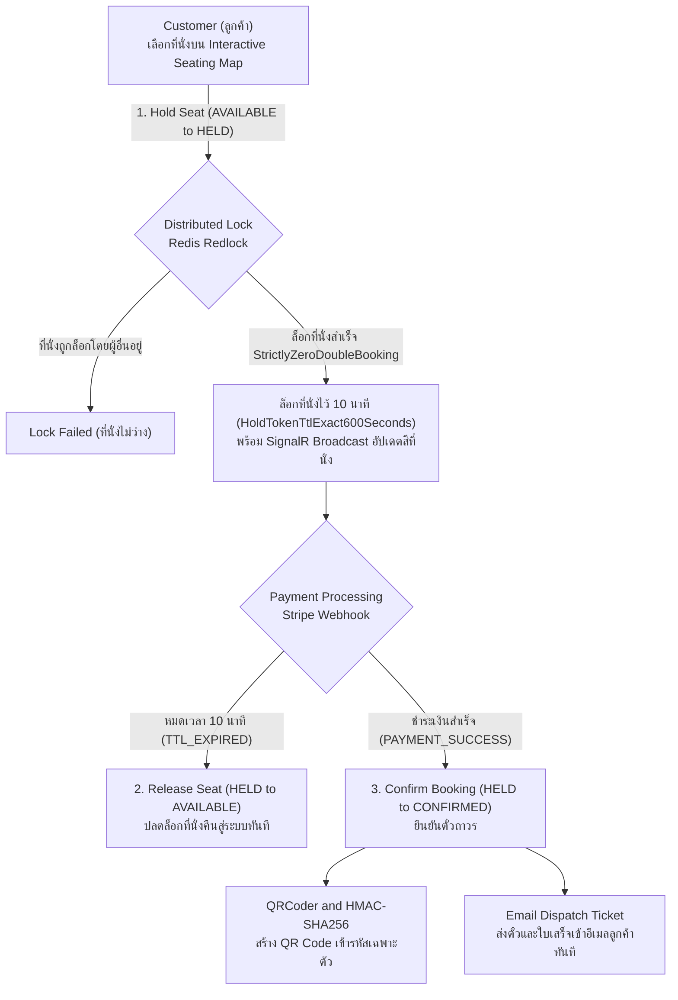
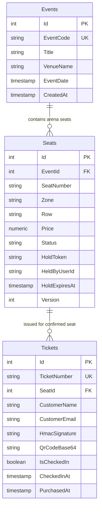

# 05_TICKETING_ENGINE: High-Concurrency Seat Reservation & Flash-Sale Engine

ระบบจำหน่ายตั๋วและจองที่นั่งคอนเสิร์ต/อีเวนต์ (High-Concurrency Ticketing Engine) ออกแบบมารองรับการแย่งจองตั๋ว (Flash-Sale) พร้อมกันหลายแสนคน โดยใช้สถาปัตยกรรม Distributed Locking (Redis Redlock), การจองที่นั่งแบบจำกัดเวลา 10 นาที (Exact 600s TTL), ผังที่นั่งแบบ Interactive Canvas 60 FPS, และตั๋ว QR Code เข้ารหัสด้วย HMAC-SHA256

---

## 🔄 ภาพรวม Workflow การทำงาน (Business & Technical Workflow)



### รายละเอียดขั้นตอนการเปลี่ยนสถานะ (State Transitions):
1. **`AVAILABLE ➔ HELD` (Trigger: `HOLD_SEAT`)**: ลูกค้าคลิกเลือกที่นั่ง ระบบใช้ Redis Redlock ล็อก Key ของที่นั่งในระดับ Atomic และนับถอยหลัง 600 วินาที พร้อมส่ง Event ผ่าน SignalR ไปบอกเบราว์เซอร์ของทุกคนในห้องว่า "ที่นั่งนี้กำลังมีผู้จอง"
2. **`HELD ➔ AVAILABLE` (Trigger: `TTL_EXPIRED`)**: หากลูกค้าไม่ชำระเงินภายใน 10 นาที Redis Key จะหมดอายุ และที่นั่งจะถูกปลดปล่อยให้ผู้อื่นเลือกได้ทันที
3. **`HELD ➔ CONFIRMED` (Trigger: `PAYMENT_SUCCESS`)**: เมื่อรับ Webhook ยืนยันยอดเงินจาก Payment Gateway ระบบจะเปลี่ยนสถานะเป็น Confirmed และสร้างตั๋ว QR Code ป้องกันการปลอมแปลง

---

## 🗄️ Database Design & Entity Relationships (PostgreSQL 18)

### 1. Entity-Relationship Diagram (ER Diagram)



### 2. รายละเอียดตารางและความสัมพันธ์ (Schema & Relationships)
- **`Events` (อีเวนต์และคอนเสิร์ต)**:
  - เก็บข้อมูลชื่อการแสดง, รหัสงาน (`EventCode`), สถานที่จัดงาน (`VenueName`), และวันเวลาแสดง
  - ความสัมพันธ์: `1 Event` มีหลาย `Seats`
- **`Seats` (ที่นั่งในฮอลล์การแสดง)**:
  - Foreign Key: `EventId` ➔ `Events(Id)`
  - Unique Constraint: `(EventId, SeatNumber)` ป้องกันการสร้างที่นั่งซ้ำในงานเดียวกัน
  - ฟิลด์สถานะ: `AVAILABLE`, `HELD`, `CONFIRMED`, `CHECKED_IN`
  - มี `HoldToken`, `HeldByUserId`, `HoldExpiresAt` สำหรับ Invariant `HoldTokenTtlExact600Seconds`
  - มี `Version` สำหรับ Optimistic Concurrency Control ร่วมกับ Invariant `StrictlyZeroDoubleBooking`
- **`Tickets` (ตั๋วเข้าชมงาน)**:
  - Foreign Key: `SeatId` ➔ `Seats(Id)`
  - เก็บดิจิทัลซิกเนเจอร์ `HmacSignature` (สร้างจาก HMAC-SHA256 ป้องกันการปลอมตั๋ว), รูปภาพ QR Code และสถานะการสแกนเข้าประตู (`IsCheckedIn`)

---

## 🛡️ กฎเหล็กของระบบ (Domain Invariants)

1. **`StrictlyZeroDoubleBooking` (ห้ามเกิดการจองซ้ำซ้อน 0.00% เด็ดขาด)**:
   - ป้องกันปัญหาที่นั่งชนกัน (Race Condition) ในช่วงเปิดขายบัตร แม้จะมีผู้ใช้งานกดพร้อมกันหลายพันคนในมิลลิวินาทีเดียวกัน จะมีเพียงคนเดียวเท่านั้นที่ได้ Lock ของที่นั่งนั้นไป
2. **`HoldTokenTtlExact600Seconds` (อายุการถือสิทธิ์จองที่นั่งต้องตรง 600 วินาทีเป๊ะ)**:
   - สิทธิ์การจองมีอายุแน่นอน 10 นาที เพื่อไม่ให้เกิดการกั๊กที่นั่ง และนำที่นั่งกลับมาหมุนเวียนขายใหม่ได้อย่างรวดเร็ว

---

## 💻 Tech Stack & เหตุผลในการเลือกใช้

| ส่วนประกอบ | เทคโนโลยีที่เลือก | เหตุผลที่เลือก | ข้อดีหลัก (Advantages) |
|---|---|---|---|
| **Database** | **PostgreSQL 18** | มาตรฐาน RDBMS รองรับ Row-Level Locking (`FOR UPDATE`) และ Indexing ความเร็วสูง | มี Auto-Init Script (`db/init.sql`) พร้อมผังที่นั่งตัวอย่าง |
| **Frontend Map** | **Next.js 16 + react-konva** | เรนเดอร์ผังที่นั่งความจุ 50,000 ที่นั่งด้วย HTML5 Canvas 2D/WebGL | เลื่อน ซูม และคลิกเลือกที่นั่งได้ลื่นไหล 60 FPS ไม่กิน Memory เหมือน DOM ธรรมดา |
| **Payment Gateway** | **@stripe/stripe-js** | ระบบรับชำระเงินระดับโลกที่ปลอดภัย รองรับบัตรเครดิตและพร้อมเพย์ | มี Webhook ยืนยันยอดเงินที่เชื่อถือได้และได้มาตรฐาน PCI-DSS Level 1 |
| **Backend API** | **.NET 10 (Native AOT)** | คอมไพล์เป็น Machine Code โดยตรง (Ahead-of-Time Compilation) | เริ่มต้นระบบได้ใน 10ms ใช้ RAM น้อยมาก ตอบสนองต่อ Request ได้เร็วระดับไมโครวินาที |
| **Distributed Lock**| **Medallion.Threading.Redis (Redlock)**| จัดการ Distributed Locking ข้ามหลาย Server Instance | ป้องกัน Double-Booking ได้ 100% แม้ระบบจะสเกลออกเป็น 100 Pods |
| **Tamper-Proof QR** | **QRCoder + HMAC-SHA256** | ตั๋ว QR Code ถูกเซ็นลายเซ็นดิจิทัลด้วย Secret Key ประจำระบบ | เครื่องสแกนหน้าประตูทางเข้าสามารถตรวจสอบตั๋วปลอมได้อย่างรวดเร็ว |

---

## 🚀 วิธีการรันระบบ (Quick Start)

### ตัวเลือกที่ 1: รันด้วย Docker Compose (แนะนำ)
```bash
docker compose up --build -d
```
> ระบบจะรัน **PostgreSQL 18** (`:5432`), **.NET 10 API** (`:5080`), และ **Next.js 16 Web** (`:3008`) พร้อม Seed ข้อมูลอีเวนต์และที่นั่งให้ใช้งานได้ทันที

### ตัวเลือกที่ 2: รันแบบแยก Service (Manual)
1. **รัน Backend API**:
   ```powershell
   cd ticking-api
   dotnet run
   ```
   > API พร้อมทำงานที่: `http://localhost:5080`
2. **รัน Frontend Web**:
   ```powershell
   cd ticking-web
   bun run dev
   ```
   > เข้าใช้งานได้ที่: `http://localhost:3008`
